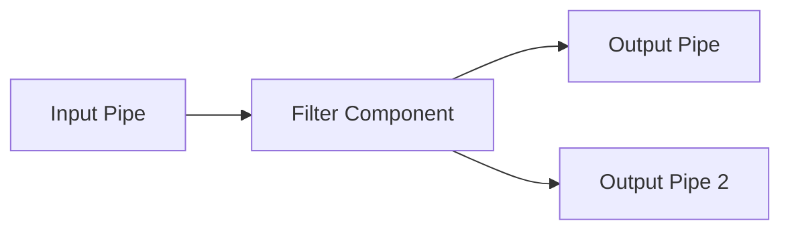
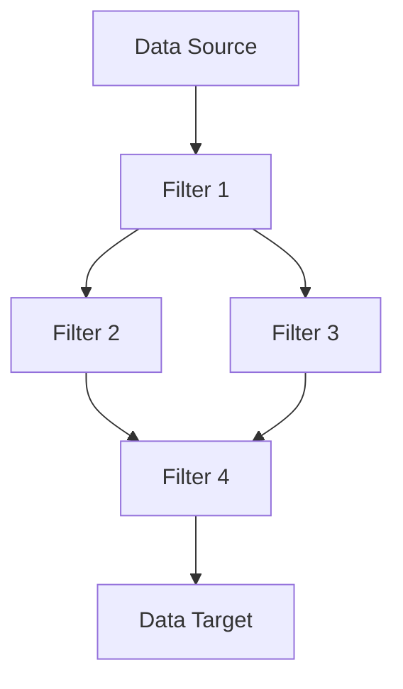
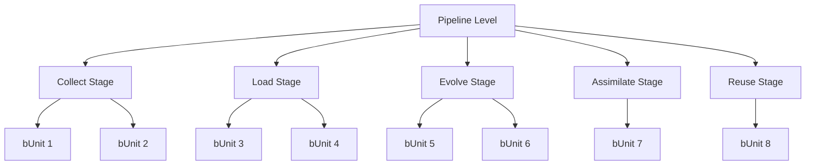
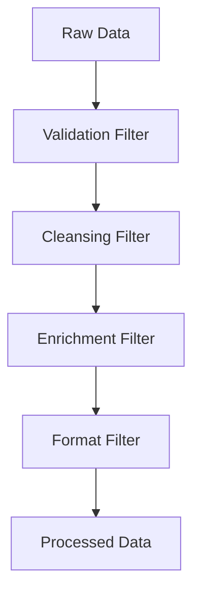
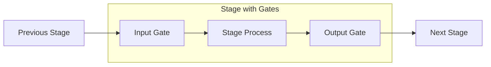
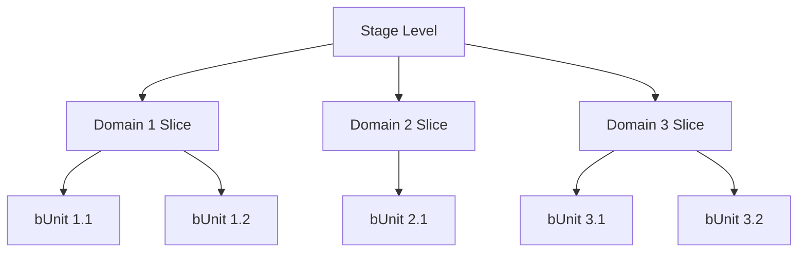
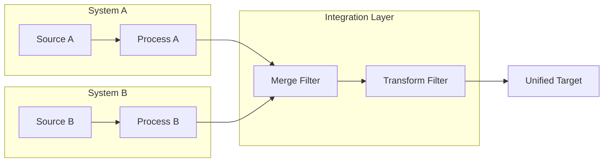
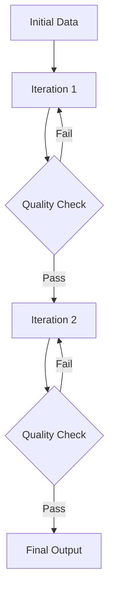
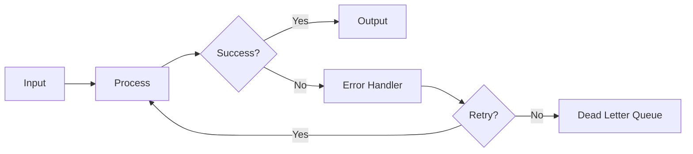

# bCLEARer Pipeline Architecture Framework

## Table of Contents

1. [Introduction](#introduction)
2. [Core Concepts](#core-concepts)
3. [Pipeline Architecture](#pipeline-architecture)
4. [Multi-Level Nesting Structure](#multi-level-nesting-structure)
5. [bCLEARer Stages (CLEAR Process)](#bclearer-stages-clear-process)
6. [Design Principles](#design-principles)
7. [Implementation Patterns](#implementation-patterns)
8. [Stage Gates and Data Flow](#stage-gates-and-data-flow)
9. [Extended Architecture](#extended-architecture)
10. [Best Practices](#best-practices)

## Introduction

### What is bCLEARer?

**bCLEARer** stands at the forefront of digital transformation, championing an evolutionary approach to harnessing digitization and digitalization opportunities. It guides information on a transformative journey, curating its evolution into fitter forms—ones more suited for computing—that deliver increased value.

### Digital Transformation Journey

The bCLEARer journey features two pivotal stages:

- **Digitization**: Extracting and converting information from existing sources into accessible, computer-readable formats for further transformation.
- **Digitalization**: Mining, extracting (making the implicit explicit), refining and evolving information to boost its utility and efficiency, enhancing its 'fitness' for digital ecosystems.

### Directed Evolution

The bCLEARer journey represents a form of directed evolution for information:
- Mimics processes of natural selection
- Steers information toward a fitter, improved state
- Provides improved visibility of transformations and data patterns
- Enables easy identification and correction of issues
- Fosters trust and reliability in the process

### Key Characteristics

- **Rapid Evolution**: Supports rapid, often radical (though resilient) evolutionary adaptations at scale
- **Dual Evolution**:
  - Information Evolution: Adaptation of information throughout its journey
  - Journey Evolution: Adaptation of the journey itself to emerging requirements
- **Adaptive Resilience**: Maintains stability and efficiency amidst continuous change
- **Wide Deployability**: Consistently deployable across various domains and project sizes
- **Flexible Stability**: Offers stability within which the system can flex

## Core Concepts

### bCLEARer Pipeline Architecture Framework (bCFAP)

The framework consists of **four primary elements**:

1. **Pipeline Architecture** - The fundamental pipe-and-filter approach
2. **Nested Gated Architecture** - Enhanced scalability through nesting and process transparency through gating
3. **Three-Core-Level Nesting Architecture** - Structured around bCLEARer's five stages
4. **Design Practices and Patterns** - General design approaches for the architecture

## Pipeline Architecture

### Overview

The bCLEARer approach implements a 'pipeline' or 'pipe-and-filter' architecture for data transformation systems. This creates a "bCLEARer pipeline" that processes data through sequential transformations.

### Pipeline Components

#### Filters

**Filters** are the transformation components:
- Transform ('filter') data received as input via pipe connectors
- Always have at least one input pipe and one output pipe
- Can have multiple input and output pipes
- Cannot flow to themselves (acyclic flow - no cycles)

#### Pipes

**Pipes** are the connectors:
- Pass messages/information to and from filters
- Unidirectional flow
- Data is persisted until the filter processes it
- Include data source pipe (start) and data target pipe (end)
- Can be adorned with data icons to highlight data transport

### Pipeline Flow Characteristics

- **Acyclic**: No cycles - filters cannot flow back to themselves
- **Flexible routing**: Filters can split and merge pipeline flows
- **Multiple connections**: Single pipe can feed from one filter to multiple filters
- **Encapsulation**: Multiple pipes between same filters should be encapsulated

## Multi-Level Nesting Structure

### Nesting Concept

Within the pipeline architecture, sub-pipelines can be encapsulated as filters with pipes. These can be nested, creating a multi-level nesting (breakdown) structure.

### Core Nesting Architectural Levels

| Level | Description |
|-------|-------------|
| **Pipeline** | Top, root level of nesting - single root pipeline filter. Upper boundary of pipeline architecture |
| **Stage** | Single boundary layer containing filters for bCLEARer digital journey stages |
| **bUnit** | Leaf nodes in nesting structure - bUnit filters. Lower boundary of pipeline architecture |

### Structure Properties

- Forms a hierarchical tree structure
- bUnits belong to one and only one bCLEARer stage
- Between core levels, nesting can be extended for further modularization

## bCLEARer Stages (CLEAR Process)

### Five Sequential Stages

The bCLEARer digital journey consists of five sequential stages:

1. **Collect**
   - Gathering data from various sources
   - Initial data acquisition phase
   - May involve multiple data formats and systems

2. **Load**
   - Computerising the collected bytes — deserialising them into an in-memory
     mirror of the source
   - **Does not change the data**: no normalisation, no validation beyond "can
     it be parsed at all?", no BIE identity assignment
   - Any normalisation, typing, or structural restructuring belongs in Evolve

3. **Evolve**
   - Transforming and evolving the data
   - Applying business rules and logic
   - Enhancing data quality and structure
   - Assigning BIE identities to data-structure artefacts (first act of Evolve)

4. **Assimilate**
   - Injecting the evolved BIE-identified fragment into the **master BORO
     ontology object store**
   - Reconciling non-compliant fragments against the master compliance model
   - Semantic integration against a persistent master store — **not** a
     pipeline-local cross-slice merge (cross-slice merges belong in Evolve)

5. **Reuse**
   - Making data available for reuse
   - Publishing to downstream systems
   - Enabling data consumption by applications

### Stage Characteristics

- **Sequential flow** reflecting the digital journey
- **Usually gated** for transparency and control
- **May involve manual work** (marked with manual icon)
- **Automation priority**: Manual work should be automated where possible
- **Early stage restriction**: When manual work is unavoidable, typically restricted to early stages (Collect or Evolve — not Load, which is strictly automated computerisation of the collected bytes)

## Design Principles

### Core Focus

Design bCLEARer pipelines to:
- **Reduce cost of evolution**, especially radical evolution
- **Facilitate transparency** throughout the transformation process

### Transparency Goals

- Deliver transparent transformations
- Enable easy inspection
- Systematize inspection to reduce effort during rapid evolution
- Build trust in transformations
- Improve value of transformations

### Two Main Principles

#### 1. Separation of Transformation Concerns

Isolating different transformation responsibilities:
- Each filter handles a specific transformation concern
- Clear boundaries between transformation types
- Enables independent evolution of components
- Reduces coupling between transformations

#### 2. Immutability and Idempotence

Ensuring data consistency and repeatability:
- **Immutability**: Data objects are not modified after creation
- **Idempotence**: Operations produce the same result regardless of repetition
- Enables reliable replay and recovery
- Simplifies debugging and testing

### General Design Approach

- Focus on **modularity** for maintainability and reusability
- Improve **refactoring and extensibility**
- Build **transparent transformations** for easy inspection
- **Systematize inspection** to reduce maintenance effort

## Implementation Patterns

### Core Practices and Patterns

Over three decades, bCLEARer has established core practices:

#### Loose Coupling and Tight Cohesion

- **Loose Coupling**: Minimize dependencies between components
- **Tight Cohesion**: Maximize functional relatedness within components
- Enables independent evolution and testing

#### Single Transformation Principle (STP)

- Each filter performs one well-defined transformation
- Similar to Single Responsibility Principle
- Enhances clarity and maintainability

#### Aggregated Single Source of Truth (SSOT)

- Maintain a single authoritative data source
- All transformations reference this source
- Reduces inconsistencies and conflicts

## Stage Gates and Data Flow

### Gate Concept

Nested pipelines are designed with input and output pipes as data stage gates, particularly for bCLEARer stage and thin slice pipelines.

### Gate Characteristics

- **Dual gate design**: Input and output gates enable inspection and comparison
- **SSOT provision**: Output gates provide clean data snapshots
- **Inspection focus**: Not decision points but inspection points in agile process
- **Quality control**: Cost-effective way to create inspection points
- **Problem isolation**: Help identify source of problems by finding first gate where issue appears

### Gate Design Process

1. Create pipe that aggregates all data flowing through pipeline end
2. Apply two-layer nesting approach
3. Encapsulate filters with pipes traveling outside pipeline
4. Result in single aggregated pipe output
5. Mark gates with gate icons and data icons

### Gate Object Accounting

Gates enable systematic accounting of data objects:
- Track objects entering and leaving stages
- Compare input vs output for quality metrics
- Identify data loss or duplication
- Monitor transformation effectiveness

## Extended Architecture

### Thin Slices Level

When breakdown from pipeline to stages involves significant complexity, stages are modularized into a nesting hierarchy of sub-pipeline filters through "thin slices."

#### Domain-based Thin Slicing

Common when pipeline covers multiple domains:
- Each domain processed independently before merging
- Systems and sub-systems form natural boundaries
- Gates placed at start and end of each thin slice

#### Intra-domain Thin Slicing

Dividing sizeable domains into smaller chunks:
- Dependencies between chunks recognized in pipeline flow
- Handles merging of data within systems and across systems
- Enables parallel processing where possible

#### Evolution Characteristics

- Thin slice pipeline evolves during project lifecycle
- Hierarchy can expand as understanding develops
- Multiple thin slices ordered by pipes into sequences
- Supports iterative refinement

### bUnits Level

The atomic level of the pipeline architecture:
- Leaf nodes in the nesting structure
- Perform specific, well-defined transformations
- Cannot be further decomposed within the framework
- Represent the actual implementation components

### Extended Levels

Between core levels, additional nesting can be introduced:
- **Sub-stages**: Breaking down stages into smaller logical groups
- **Process groups**: Clustering related transformations
- **Service layers**: Organizing by technical architecture layers

## Best Practices

### Pipeline Design

1. **Start Simple**: Begin with core levels, extend as needed
2. **Gate Everything**: Place gates at all major boundaries
3. **Document Transformations**: Maintain clear documentation of each filter's purpose
4. **Version Control**: Track pipeline evolution through versioning
5. **Test at Gates**: Use gates as natural testing boundaries

### Performance Optimization

1. **Parallel Processing**: Leverage thin slicing for parallelization
2. **Lazy Evaluation**: Process data only when needed
3. **Streaming**: Use streaming for large datasets
4. **Caching**: Cache intermediate results at gates
5. **Resource Management**: Monitor and optimize resource usage

### Quality Assurance

1. **Gate Validation**: Validate data at each gate
2. **Error Handling**: Implement robust error handling in filters
3. **Logging**: Comprehensive logging at filter and gate levels
4. **Monitoring**: Real-time monitoring of pipeline health
5. **Audit Trails**: Maintain audit trails through gates

### Evolution Management

1. **Incremental Changes**: Evolve pipeline incrementally
2. **Backward Compatibility**: Maintain compatibility when possible
3. **Migration Paths**: Define clear migration paths for changes
4. **Impact Analysis**: Assess impact before changes
5. **Rollback Strategy**: Have rollback plans for all changes

### Governance

1. **Ownership**: Clear ownership of pipeline components
2. **Standards**: Enforce coding and design standards
3. **Reviews**: Regular architecture and code reviews
4. **Documentation**: Keep documentation current
5. **Training**: Ensure team understanding of framework

## Architectural Patterns

### Pattern: Multi-System Integration

### Pattern: Iterative Refinement

### Pattern: Error Recovery

## BORO and BIE — two distinct ontologies

The bCLEARer framework works with **two related but distinct ontologies**:

- **Master BORO ontology** — models real-world business objects (extensional,
  4D, curated). It lives in the **master BORO ontology object store** and is
  the authoritative semantic reference for the organisation.
- **BIE ontology** — identifies **data-structure artefacts** (the files,
  records, cells, nodes, and in-memory objects that carry information about
  the real world). A `bie_id` identifies a data structure, not the real-world
  referent it describes.

The two are **correlated but not identical**. Pipelines produce BIE-identified
fragments in Evolve. The **Assimilate** stage (`4a_assimilate`) is the bridge:
it injects the evolved BIE fragment into the master BORO ontology object
store and reconciles non-compliance against the master compliance model.

### BORO principles bCLEARer inherits

- **Ontological Foundation**: BORO provides the semantic foundation
- **Object Identity**: Clear identification of business objects
- **Temporal Aspects**: Handling of time and change
- **Extensional Approach**: Focus on instances rather than classes
- **4D Paradigm**: Objects extended in space and time

BIE identity composition is aligned with these principles, but a BIE identity
is not a BORO identity — it is a data-structure identity.

## Conclusion

The bCLEARer Pipeline Architecture Framework provides a robust, scalable, and transparent approach to data transformation. Its multi-level nesting structure, combined with strong design principles and implementation patterns, enables organizations to:

- Build resilient data transformation pipelines
- Maintain transparency throughout the process
- Support rapid evolution and adaptation
- Ensure data quality and consistency
- Scale from simple to complex transformations

The framework's emphasis on gates, immutability, and separation of concerns creates a system that is both powerful and maintainable, suitable for enterprise-scale digital transformation initiatives.

## Appendices

### Appendix A: Glossary

- **bCFAP**: bCLEARer Framework Architecture Patterns
- **bUnit**: Basic unit of transformation in the pipeline
- **CLEAR**: Collect, Load, Evolve, Assimilate, Reuse
- **Filter**: Component that transforms data
- **Gate**: Inspection point between pipeline stages
- **Pipe**: Connector that passes data between filters
- **SSOT**: Single Source of Truth
- **STP**: Single Transformation Principle
- **Thin Slice**: Modular subdivision of a stage

### Appendix B: References

- BORO Foundation Documentation
- Pipeline Architecture Patterns
- Clean Code Principles (Martin, 2012)
- Structured Design (Stevens, 1974)
- Business Objects (Partridge, 1996)

### Appendix C: Version History

- Version 1.0: Initial framework documentation
- Based on 30+ years of bCLEARer evolution
- Incorporates lessons from multiple enterprise implementations
