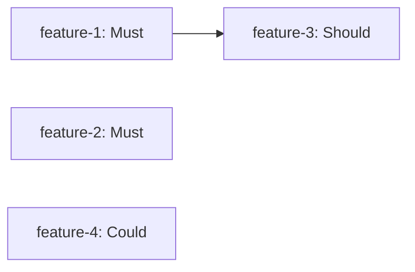

# {Release Name} — Release Plan

> Generated by `release-planner` skill (Phase 0.5 of ol-sdd-workflow). Features listed here become JIRA epics; individual specs are produced per-feature by `feature-spec-author` at Phase 1.

## Goal

{one-sentence release theme — the single outcome that defines success for this release}

## Narrative

{2–3 paragraphs: what we're delivering, why now, who benefits, what changes after this release lands. Reference product.md vision elements this release advances.}

## Release Window

| | |
|---|---|
| Target date | {YYYY-MM-DD} |
| Duration | {N} weeks |
| Capacity | {H} hours across {E} engineers |
| Headroom reserved | {15%} |
| Effective capacity | {H × 0.85} hours |

## Scope Tiers

### Minimum Viable Scope
Features that MUST ship for the release to be meaningful. Sum of estimates: {h}h.

### Target Scope (recommended)
Minimum + high-value Shoulds. Sum: {h}h (~{%} of effective capacity).

### Stretch Scope
Target + nice-to-haves if Musts land early. Sum: {h}h.

## Feature List

Ordered by priority within each tier.

### Must (minimum viable)

| # | Feature | Description | T-Size | Depends On | Unlocks |
|---|---------|-------------|--------|------------|---------|
| 1 | `{feature-name-1}` | {1-line value description} | M | — | feature-3 |
| 2 | `{feature-name-2}` | {1-line value description} | S | — | — |

### Should

| # | Feature | Description | T-Size | Depends On | Unlocks |
|---|---------|-------------|--------|------------|---------|
| 3 | `{feature-name-3}` | {1-line value description} | M | feature-1 | — |

### Could

| # | Feature | Description | T-Size | Depends On | Unlocks |
|---|---------|-------------|--------|------------|---------|
| 4 | `{feature-name-4}` | {1-line value description} | L | — | — |

### Won't (this release)

| # | Feature | Why Deferred | Target Release |
|---|---------|--------------|----------------|
| 5 | `{feature-name-5}` | Capacity | next |

## T-Shirt Sizing Legend

| Size | Rough hours | Typical scope |
|------|-------------|---------------|
| XS | ~8h | One file change, one test |
| S | ~24h | One service/component, a few files |
| M | ~60h | Cross-cutting small feature, full-stack |
| L | ~120h | Multi-component feature, new data model |
| XL | ~240h | New subsystem, architectural addition |

These are rough order-of-magnitude estimates for prioritisation. Detailed estimates happen in Phase 1 (per-task).

## Dependencies

## Timeline (indicative)

If there is a rough phasing within the release (not sprint-level — that's Phase 3):

| Phase | Features | Why this order |
|-------|----------|----------------|
| Early | feature-1, feature-2 | Unblocks downstream; minimum viable slice |
| Mid | feature-3 | Depends on feature-1 |
| Late | feature-4 | Polish; only if time remains |

## Success Criteria

Measurable outcomes that define whether this release achieved its goal:

- {metric 1 with target}
- {metric 2 with target}
- {qualitative outcome, e.g., "pilot customer able to run X end-to-end"}

## Risks and Open Questions

| Risk / Question | Owner | Impact | Mitigation / Answer |
|-----------------|-------|--------|---------------------|
| {description} | {person} | High/Med/Low | {plan or TBD} |

## Linked JIRA Epics

Populated after release-planner publishes. One empty epic per in-scope feature. Specs are added by `feature-spec-author` and fleshed into stories/subtasks by `backlog-manager`.

| Feature | Priority | JIRA Epic | Spec Status |
|---------|----------|-----------|-------------|
| feature-1 | Must | [TI-100](url) | not specced |
| feature-2 | Must | [TI-101](url) | not specced |

## Replan History

> Populated if the release is re-planned mid-flight. Each entry appended; earlier entries never rewritten.

### Replan {YYYY-MM-DD}

Trigger: {what forced the replan — new priority, deferred dep, capacity change}

Changes:
- {added/removed/reprioritised feature + rationale}
