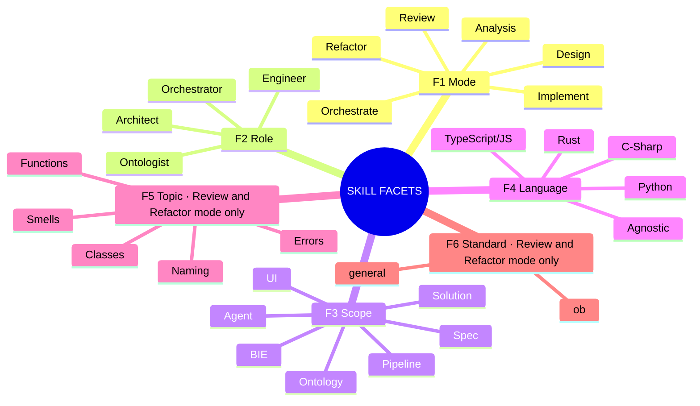
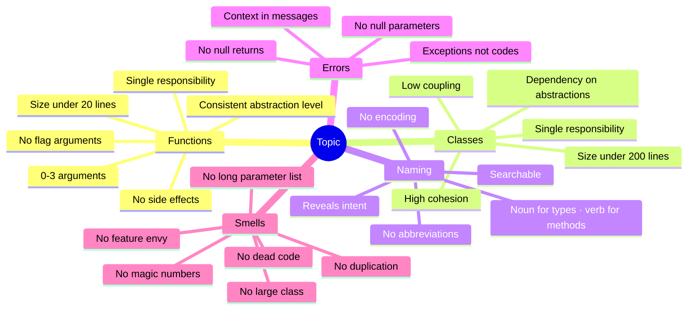
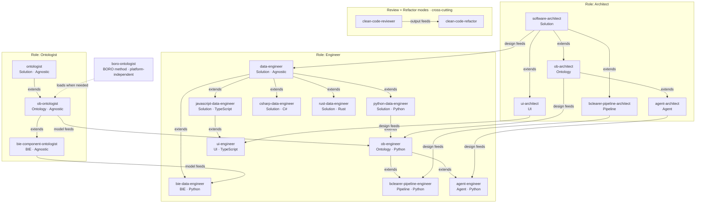

# Skill Architecture: Facet Diagram

A faceted classification of the skill library — each skill is uniquely addressed by a combination of facet values.

---

## Facet Taxonomy



**Operation is derived, not a facet**: `Scope + Role` → Operation name.

| Scope | Architect | Engineer | Ontologist |
|---|---|---|---|
| Solution | Solution Architecture | Solution Implementation | Solution Ontology |
| Ontology | Ontology Design | Ontology Implementation | Ontology Analysis (OB) |
| Pipeline | Pipeline Architecture | Pipeline Implementation | — |
| Agent | Agent Architecture | Agent Implementation | — |
| UI | UI Design | UI Implementation | — |
| BIE | BIE Design | BIE Implementation | BIE Component Ontology |

---

## Skills Placement Matrix

| Skill | Mode | Role | Scope | Language | → Operation |
|---|---|---|---|---|---|
| `software-architect` | Design | Architect | Solution | Agnostic | Solution Architecture |
| `bclearer-pipeline-architect` | Design | Architect | Pipeline | Agnostic | Pipeline Architecture |
| `ob-architect` | Design | Architect | Ontology | Agnostic | Ontology Architecture |
| `ontologist` | Analysis | Ontologist | Solution | Agnostic | Ontological Analysis |
| `ob-ontologist` | Analysis | Ontologist | Ontology | Agnostic | BORO Ontological Analysis |
| `bie-component-ontologist` | Analysis | Ontologist | BIE | Agnostic | BIE Component Ontology |
| `data-engineer` | Implement | Engineer | Solution | Agnostic | Solution Implementation |
| `python-data-engineer` | Implement | Engineer | Solution | Python | Solution Implementation |
| `javascript-data-engineer` | Implement | Engineer | Solution | TypeScript | Solution Implementation |
| `csharp-data-engineer` | Implement | Engineer | Solution | C# | Solution Implementation |
| `rust-data-engineer` | Implement | Engineer | Solution | Rust | Solution Implementation |
| `bie-data-engineer` | Implement | Engineer | BIE | Python | BIE Implementation |
| `ob-engineer` | Implement | Engineer | Ontology | Python | Ontology Implementation |
| `bclearer-pipeline-engineer` | Implement | Engineer | Pipeline | Python | Pipeline Implementation |
| `agent-architect` | Design | Architect | Agent | Agnostic | Agent Architecture |
| `agent-engineer` | Implement | Engineer | Agent | Python | Agent Implementation |
| `ui-architect` | Design | Architect | UI | Agnostic | UI Design |
| `ui-engineer` | Implement | Engineer | UI | TypeScript | UI Implementation |
| `clean-code-reviewer` | Review | Engineer | Solution | Multi | _(cross-cutting)_ |
| `clean-code-refactor` | Refactor | Engineer | Solution | Multi | _(cross-cutting)_ |
| `clean-code-naming` | Review/Fix/Suggest | Engineer | Solution | Multi | _(cross-cutting)_ |
| `clean-code-tests` | Generate/Review/Coverage | Engineer | Solution | Multi | _(cross-cutting)_ |
| `clean-code-commit` | Validate/Generate | Engineer | Solution | Agnostic | _(cross-cutting)_ |
| `ol-sdd-workflow` | Orchestrate | Orchestrator | Spec | Agnostic | OL Spec-Driven Development Workflow (master) |
| `product-vision-steering` | Design | Architect | Spec | Agnostic | Phase 0 — Steering |
| `release-planner` | Design | Architect | Spec | Agnostic | Phase 0.5 — Release Plan |
| `feature-spec-author` | Design | Architect | Spec | Agnostic | Phase 1 — Feature Spec |
| `backlog-manager` | Orchestrate | Orchestrator | Spec | Agnostic | Phase 2 — JIRA Backlog |
| `sprint-planner` | Orchestrate | Orchestrator | Spec | Agnostic | Phase 3 — Sprint Plan |
| `sprint-executor` | Orchestrate | Orchestrator | Spec | Agnostic | Phase 4 — Tech-Lead Execution |
| `jira-task-executor` | Orchestrate | Orchestrator | Spec | Agnostic | Single-ticket execution via Codex (sub-skill of `sprint-executor` / `jira-epic-executor`) |
| `jira-epic-executor` | Orchestrate | Orchestrator | Spec | Agnostic | Epic-wide execution — discovers children, builds dep graph, runs waves, delegates each ticket to `jira-task-executor` |
| `jira-impl-logger` | Orchestrate | Orchestrator | Spec | Agnostic | Phase 5 — JIRA Impl Log |
| `confluence-space-manager` | Orchestrate | Orchestrator | Spec | Agnostic | Confluence space create / audit / align (cross-cutting infrastructure) |

> All clean-code skills are cross-cutting — they apply across all scopes. `clean-code-reviewer`, `clean-code-refactor`, `clean-code-naming`, and `clean-code-tests` support `standard: general | ob`. `clean-code-commit` does not use the standard facet.
>
> `boro-ontologist` is a **platform-independent BORO methodology dependency skill**. It sits beneath the primary facet grid and is loaded by `ob-ontologist` when deeper BORO foundations, patterns, or re-engineering references are required. It is intended for reuse by future BORO-native model skills such as BNOP (Python) and later language-specific variants.

---

## Clean Coding Topics: Sub-Facet of Review / Refactor

Clean coding topics are a conditional facet — they only apply when **Mode = Review or Refactor**. They define *what* is being examined or fixed. In Implement mode, all topics apply holistically; in Review/Refactor they can be targeted.

### Topic Taxonomy



### Topic Priority Order (for full review)

When no topic is specified (`full` mode), apply in this order to minimise rework:

```
Functions → Classes → Naming → Errors → Smells
    ↑            ↑        ↑        ↑        ↑
  structure   structure  labels  safety  cleanup
  (rename     (split     (after  (after  (last —
  after)      after      rename) struct) depends
              rename)             fixed)  on all)
```

### Topics Are Cross-Cutting Across All Scopes

Topics apply to **any** engineer skill operating in Review or Refactor mode, regardless of scope:

```
                   TOPIC
                   ─────────────────────────────────────────────────
                   Functions  Classes  Naming  Errors  Smells
SCOPE              ─────────────────────────────────────────────────
Solution           ✓          ✓        ✓       ✓       ✓
BIE                ✓          ✓        ✓       ✓       ✓
Pipeline           ✓          ✓        ✓       ✓       ✓
Ontology           ✓          ✓        ✓       ✓       ✓
UI                 ✓          ✓        ✓       ✓       ✓
─────────────────────────────────────────────────────────────────────
```

The `clean-code-reviewer` and `clean-code-refactor` skills are the dedicated, composable implementations. Embedded review modes within architect/engineer skills are implicitly full-topic reviews scoped to their domain.

### Standard Facet (F6): `general` | `ob`

**Standard** is a second conditional facet — it applies to all clean-code skills except `clean-code-commit`. It controls *which convention set* the skill enforces.

| Value | Convention Set | Source |
|-------|---------------|--------|
| `general` | Clean Code (Robert C. Martin) | `prompts/coding/standards/clean_coding/` |
| `ob` (Python) | BORO Quick Style Guide + Clean Code base | `ob-engineer/references/boro-quick-style-guide.md` |
| `ob` (Rust) | BORO Quick Style Guide (Rust) + Clean Code base | `ob-engineer/references/boro-quick-style-guide-rust.md` |

When `standard=ob`, the skill loads the language-appropriate OB overrides on top of the general set. Where they conflict, OB wins (see conflict table in `boro-skills-plan.md` Part 5). Rules not covered by OB fall back to `general`. The Rust guide includes additional Rust-specific sections (ownership, types, iterators, concurrency) derived from the same BORO design philosophy.

Standard defaults to `general` when omitted.

### Extended Canonical Address (with Topic and Standard)

Full address format: `[Role]:[Mode]:[Scope]:[Language]:[Topic]:[Standard]`

| Canonical Address | Meaning |
|---|---|
| `engineer:review:solution:python:full` | clean-code-reviewer, all topics, general standard |
| `engineer:review:solution:python:full:ob` | clean-code-reviewer, all topics, OB conventions |
| `engineer:review:solution:python:naming` | clean-code-reviewer, naming only, general |
| `engineer:review:solution:python:naming:ob` | clean-code-reviewer, naming only, OB conventions |
| `engineer:refactor:solution:python:naming:ob` | clean-code-refactor, fix naming, OB conventions |
| `engineer:refactor:solution:python:smells` | clean-code-refactor, fix smells, general |
| `engineer:review:pipeline:python:errors:ob` | pipeline engineer reviewing error handling, OB style |

Both Topic and Standard default to `full` / `general` when omitted.

---

## Mode × Role: The Two-Axis Model

```
             ROLE
             ──────────────────────────────────────────────────────────────────
             Architect             Engineer              Ontologist
MODE ────────────────────────────────────────────────────────────────────────────
Design   │   PRIMARY               (upstream input)      (upstream input)
         │   s-arch,
         │   bcl-arch, ob-arch
─────────────────────────────────────────────────────────────────────────────────
Analysis │   (downstream consumer) (downstream consumer) PRIMARY
         │                                               ontologist, ob-ont,
         │                                               bie-comp-ont
─────────────────────────────────────────────────────────────────────────────────
Implement│   (driven by design)    PRIMARY               (model feeds engineer)
         │                         d-eng, py-eng,
         │                         js/cs/rs-eng,
         │                         bie-eng, bcl-eng
─────────────────────────────────────────────────────────────────────────────────
Review   │   embedded in each      cc-reviewer            embedded in each
         │   Architect skill       + embedded in each     Ontologist skill
         │   (gap analysis)        Engineer skill         (model validation)
─────────────────────────────────────────────────────────────────────────────────
Refactor │   structural changes    cc-refactor            (via new analysis)
         │   (via new design)      (code-level only)
```

---

## Skills Space: Scope × Language Grid

```
              LANGUAGE AXIS
              ──────────────────────────────────────────────────────────
              Agnostic       Python   TypeScript   C#     Rust    Multi
              ──────────────────────────────────────────────────────────
S  Solution   data-eng       py-eng   js-eng       cs-eng rs-eng  cc-rev
C             ontologist‡                                          cc-ref
O  Ontology   ob-arch†       ob-eng   ·            ·      ·       ·
P             ob-ontologist‡
E  Pipeline   bcl-arch†      bcl-eng  ·            ·      ·       ·
   Agent      agent-arch†    agent-eng ·           ·      ·       ·
   UI         ui-arch†       ·        ui-eng       ·      ·       ·
   BIE        bie-comp-ont‡  bie-eng  ·            ·      ·       ·
──────────────────────────────────────────────────────────────────────
  † = Architect role (Design mode)
  ‡ = Ontologist role (Analysis mode)
  · = gap (no skill exists for this combination)
  Note: bcl-eng inherits from ob-eng (bclearer is an OB-specific framework)
  Note: bie-comp-ont inherits from ob-ontologist (BIE is an OB/BORO framework)
```

---

## Inheritance Hierarchy



---

## Mode × Scope Lanes

```
MODE:      Design ──► Analysis ──────────► Implement ──────────► Review/Refactor

           ┌────────────┐                  ┌───────────────┐    ╔══════════════╗
Solution   │ software-  │                  │ data-engineer │───►║ clean-code-  ║
           │ architect  │─────────────────►│ (+ language   │    ║ reviewer     ║
           └────────────┘  ┌────────────┐  │  variants)    │    ║ clean-code-  ║
                           │ ontologist │  └───────────────┘    ║ refactor     ║
                           └─────┬──────┘                       ╚══════════════╝
                                 │extends                              ↑
           ┌────────────┐  ┌─────▼──────┐  ┌───────────────┐   applies to
Ontology   │ ob-        │  │ ob-        │  │ ob-engineer   │   all scopes
           │ architect  │  │ ontologist │─►│ (BORO/Ontlgy) │
           └────────────┘  └─────┬──────┘  └───────┬───────┘
                  │              │extends          │extends
                  │        ┌─────▼──────┐  ┌───────▼───────┐
BIE               │        │ bie-comp-  │  │ bie-data-     │
                  │        │ ontologist │─►│ engineer      │
                  │        └────────────┘  └───────────────┘
                  │
           ┌──────▼─────┐                  ┌───────────────┐
Pipeline   │ bclearer-  │────────────────►│ bclearer-     │
           │ pipe-arch  │                  │ pipeline-eng  │
           └────────────┘                  │ (inherits     │
                                           │  ob-engineer) │
                                           └───────────────┘

           ┌────────────┐                  ┌───────────────┐
Agent      │ agent-     │────────────────►│ agent-        │
           │ architect  │                  │ engineer      │
           └────────────┘                  │ (inherits     │
                                           │  ob-engineer) │
                                           └───────────────┘
UI         ┌────────────┐                  ┌───────────────┐
           │ ui-        │────────────────►│ ui-engineer   │
           │ architect  │                  │ (TypeScript)  │
           └────────────┘                  └───────────────┘
```

---

## Structural Observations

### 1. Operation is Fully Derived
Removing Operation as a facet is correct — `Scope + Role` composes it unambiguously. No information is lost; the operation name is readable from any skill's facet address.

### 2. Scope Clarifies What Domain Conflated
The old "Domain" value "bclearer Pipeline" conflated scope (Pipeline) with platform (bclearer). The new model separates these: scope is Pipeline, platform specificity is captured in the skill name and references. This makes the grid extensible to other pipeline platforms.

### 3. UI Scope Is Present but Unpopulated
The UI scope is named in the taxonomy but has no skills yet. This makes the gap explicit and shows where the library needs to grow.

### 4. Planned Inheritance Migration (`bie-data-engineer`)

`bie-data-engineer` currently inherits from `python-data-engineer`. It will eventually inherit from `ob-engineer` (BIE is an OB-specific framework, like bclearer). This change is **deferred** until `ob-engineer` is built and validated in production. `bie-data-engineer` is battle-hardened; its inheritance chain will not be touched until Phase 7 of the skills plan.

The inheritance diagram above reflects the **current** state. When Phase 7 completes, `BIE_E` will move from `DE → BIE_E` to `OB_E → BIE_E`.

### 5. Identified Gaps

| Gap | Facet Coords | Implication |
|---|---|---|
| BIE × non-Python | Implement / Engineer / BIE / TypeScript, C#, Rust | BIE impl locked to Python |
| Pipeline × non-Python | Implement / Engineer / Pipeline / TypeScript, C#, Rust | Pipeline impl locked to Python |
| Agent × non-Python | Implement / Engineer / Agent / TypeScript, C#, Rust | Agent impl locked to Python (ol_ai_services is Python) |
| Ontology × non-Python | Implement / Engineer / Ontology / TypeScript, C#, Rust | `ob-engineer` (Python) exists; other languages still gaps |
| UI × non-TypeScript | Implement / Engineer / UI / Python, C#, Rust | `ui-engineer` (TypeScript) exists; other UI languages still gaps |
| UI × Architect (non-Agnostic) | Design / Architect / UI / Python, C# | `ui-architect` is agnostic; no platform-specific UI architect variants |
| Architect:Refactor | Refactor / Architect / * | No structural refactoring skill |
| Architect:Review (standalone) | Review / Architect / * | Architecture review is embedded, not composable |
| Pipeline × Ontologist | Analysis / Ontologist / Pipeline / * | No pipeline ontologist (pipeline domains analysed via ob-ontologist) |
| Agent × Ontologist | Analysis / Ontologist / Agent / * | No agent ontologist (agent domains analysed via ob-ontologist) |

### 6. BORO Methodology Is Reusable Below the Facet Grid

`boro-ontologist` is intentionally **not** a second canonical ontology-role entry beside
`ob-ontologist`. Instead, it is the reusable BORO methodology layer that `ob-ontologist`
loads when deeper BORO references are needed. This keeps the public skill taxonomy clean
while allowing the same BORO source material to be reused later by BNOP (Python) and
future language-specific BORO-native model skills.

---

## Canonical Skill Address

Format: `[Role]:[Mode]:[Scope]:[Language]`

| Canonical Address | Skill |
|---|---|
| `architect:design:solution:*` | software-architect |
| `architect:design:pipeline:*` | bclearer-pipeline-architect |
| `architect:design:ontology:*` | ob-architect |
| `ontologist:analysis:solution:*` | ontologist |
| `ontologist:analysis:ontology:*` | ob-ontologist |
| `ontologist:analysis:bie:*` | bie-component-ontologist |
| `engineer:implement:solution:*` | data-engineer |
| `engineer:implement:solution:python` | python-data-engineer |
| `engineer:implement:solution:typescript` | javascript-data-engineer |
| `engineer:implement:solution:csharp` | csharp-data-engineer |
| `engineer:implement:solution:rust` | rust-data-engineer |
| `engineer:implement:bie:python` | bie-data-engineer |
| `engineer:implement:ontology:python` | ob-engineer |
| `engineer:implement:pipeline:python` | bclearer-pipeline-engineer |
| `architect:design:agent:*` | agent-architect |
| `engineer:implement:agent:python` | agent-engineer |
| `architect:design:ui:agnostic` | ui-architect |
| `engineer:implement:ui:typescript` | ui-engineer |
| `engineer:review:solution:multi` | clean-code-reviewer |
| `engineer:refactor:solution:multi` | clean-code-refactor |
| `orchestrator:orchestrate:confluence:agnostic` | confluence-space-manager |
| `orchestrator:feedback:skill:agnostic` | skill-feedback |

Auxiliary dependency skill: `boro-ontologist` (platform-independent BORO methodology;
loaded by `ob-ontologist` when required)

---

## Spec-Driven Workflow Orchestration (Phase Stack)

A separate orchestration layer that sits *above* the architect/engineer/ontologist grid. It drives a project end-to-end through five phases, with explicit user approval gates between phases and structured implementation logs published to JIRA (not the repo).

```
┌─────────────────────────────────────────────────────────────────┐
│  ol-sdd-workflow  (master orchestrator)                         │
│  workflow:orchestrate:sdd:agnostic                              │
└─────────────────────────────────────────────────────────────────┘
       │
       ├─► Phase 0  product-vision-steering  →  product.md · tech.md · structure.md
       │      gate: user approves steering
       ├─► Phase 0.5 release-planner          →  features.md · Confluence roadmap · JIRA epic skeletons
       │      gate: user approves feature list and scope tier (optional phase)
       ├─► Phase 1  feature-spec-author       →  requirements.md · design.md · tasks.md
       │      internal gates: requirements → design → tasks
       │      (wraps software-architect feature-design mode)
       ├─► Phase 2  backlog-manager           →  JIRA epic · stories · subtasks
       │      gate: user approves ticket structure
       ├─► Phase 3  sprint-planner            →  sprint-kickoff.md · JIRA sprint
       │      gate: user approves sprint scope
       ├─► Phase 4  sprint-executor           →  code commits · JIRA transitions
       │      tech-lead loop — delegates per-ticket to engineer skills
       │      then reviews via clean-code-reviewer
       └─► Phase 5  jira-impl-logger          →  structured JIRA comment per task
              (artifact schema adapted from spec-workflow-mcp)
```

| Skill | Phase | Invokes | Outputs |
|---|---|---|---|
| `ol-sdd-workflow` | master | all of the below | controls flow, enforces gates |
| `product-vision-steering` | 0 | — | `documentation/steering/*.md` + Confluence |
| `release-planner` | 0.5 | Atlassian MCP | `documentation/releases/{release}/features.md`, `epic-map.md` + Confluence roadmap + skeleton JIRA epics |
| `feature-spec-author` | 1 | `software-architect` | `documentation/specs/{feat}/*.md` + Confluence; attaches to release epic if present |
| `backlog-manager` | 2 | Atlassian MCP | JIRA stories/subtasks under existing (release) or new epic + ticket-map.md |
| `sprint-planner` | 3 | JIRA queries | `documentation/sprints/sprint-{N}-kickoff.md` |
| `sprint-executor` | 4 | engineer skills, `clean-code-reviewer`, `clean-code-commit`, `jira-impl-logger` | commits + JIRA transitions |
| `jira-impl-logger` | 5 | Atlassian MCP | JIRA issue comment (impl log) |
| `confluence-space-manager` | infrastructure (cross-cutting) | Atlassian MCP | Confluence space scaffold / audit report / aligned page tree — provides the *containers* the phase skills publish into |
| `skill-feedback` | infrastructure (cross-cutting) | `gh` CLI | GitHub issue capturing skill defect — structured feedback loop for skill improvement |

The phase skills are themselves orchestrators (they invoke architect/engineer skills under the hood) — they do NOT duplicate design or implementation logic. The engineer skills (`python-data-engineer`, `ui-engineer`, `ob-engineer`, etc.) are the actual code producers, invoked by `sprint-executor` via the skill-routing table in `skills/feature-spec-author/references/skill-routing.md`.
