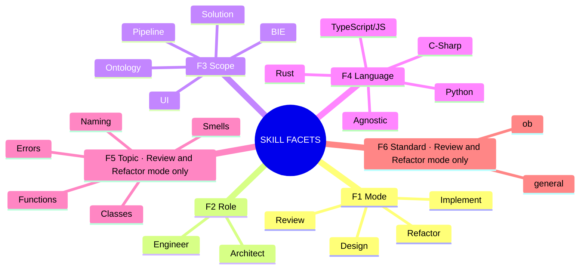
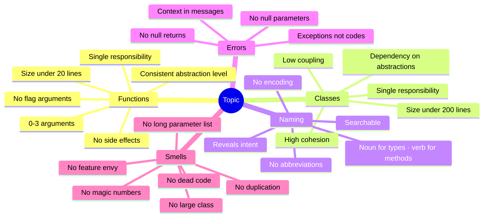
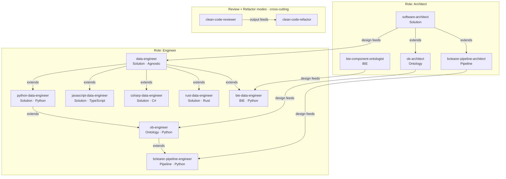

# Skill Architecture: Facet Diagram

A faceted classification of the skill library — each skill is uniquely addressed by a combination of facet values.

---

## Facet Taxonomy



**Operation is derived, not a facet**: `Scope + Role` → Operation name.

| Scope | Architect | Engineer |
|---|---|---|
| Solution | Solution Architecture | Solution Implementation |
| Ontology | Ontology Design | Ontology Implementation |
| Pipeline | Pipeline Architecture | Pipeline Implementation |
| UI | UI Design | UI Implementation |
| BIE | BIE Design | BIE Implementation |

---

## Skills Placement Matrix

| Skill | Mode | Role | Scope | Language | → Operation |
|---|---|---|---|---|---|
| `software-architect` | Design | Architect | Solution | Agnostic | Solution Architecture |
| `bie-component-ontologist` | Design | Architect | BIE | Agnostic | BIE Design |
| `bclearer-pipeline-architect` | Design | Architect | Pipeline | Agnostic | Pipeline Architecture |
| `ob-architect` | Design | Architect | Ontology | Agnostic | Ontology Architecture |
| `data-engineer` | Implement | Engineer | Solution | Agnostic | Solution Implementation |
| `python-data-engineer` | Implement | Engineer | Solution | Python | Solution Implementation |
| `javascript-data-engineer` | Implement | Engineer | Solution | TypeScript | Solution Implementation |
| `csharp-data-engineer` | Implement | Engineer | Solution | C# | Solution Implementation |
| `rust-data-engineer` | Implement | Engineer | Solution | Rust | Solution Implementation |
| `bie-data-engineer` | Implement | Engineer | BIE | Python | BIE Implementation |
| `ob-engineer` | Implement | Engineer | Ontology | Python | Ontology Implementation |
| `bclearer-pipeline-engineer` | Implement | Engineer | Pipeline | Python | Pipeline Implementation |
| `clean-code-reviewer` | Review | Engineer | Solution | Multi | _(cross-cutting)_ |
| `clean-code-refactor` | Refactor | Engineer | Solution | Multi | _(cross-cutting)_ |

> `clean-code-reviewer` and `clean-code-refactor` are cross-cutting — they apply across all scopes. Assigned to Solution scope as the broadest default.

---

## Clean Coding Topics: Sub-Facet of Review / Refactor

Clean coding topics are a conditional facet — they only apply when **Mode = Review or Refactor**. They define *what* is being examined or fixed. In Implement mode, all topics apply holistically; in Review/Refactor they can be targeted.

### Topic Taxonomy



### Topic Priority Order (for full review)

When no topic is specified (`full` mode), apply in this order to minimise rework:

```
Functions → Classes → Naming → Errors → Smells
    ↑            ↑        ↑        ↑        ↑
  structure   structure  labels  safety  cleanup
  (rename     (split     (after  (after  (last —
  after)      after      rename) struct) depends
              rename)             fixed)  on all)
```

### Topics Are Cross-Cutting Across All Scopes

Topics apply to **any** engineer skill operating in Review or Refactor mode, regardless of scope:

```
                   TOPIC
                   ─────────────────────────────────────────────────
                   Functions  Classes  Naming  Errors  Smells
SCOPE              ─────────────────────────────────────────────────
Solution           ✓          ✓        ✓       ✓       ✓
BIE                ✓          ✓        ✓       ✓       ✓
Pipeline           ✓          ✓        ✓       ✓       ✓
Ontology           ✓          ✓        ✓       ✓       ✓
UI                 ✓          ✓        ✓       ✓       ✓
─────────────────────────────────────────────────────────────────────
```

The `clean-code-reviewer` and `clean-code-refactor` skills are the dedicated, composable implementations. Embedded review modes within architect/engineer skills are implicitly full-topic reviews scoped to their domain.

### Standard Facet (F6): `general` | `ob`

**Standard** is a second conditional facet — like Topic, it only applies in **Review or Refactor mode**. It controls *which convention set* the skill enforces.

| Value | Convention Set | Source |
|-------|---------------|--------|
| `general` | Clean Code (Robert C. Martin) | `prompts/coding/standards/clean_coding/` |
| `ob` | BORO Quick Style Guide + Clean Code base | `ob-engineer/references/boro-quick-style-guide.md` |

When `standard=ob`, the skill loads the OB overrides on top of the general set. Where they conflict, OB wins (see conflict table in `boro-skills-plan.md` Part 5). Rules not covered by OB fall back to `general`.

Standard defaults to `general` when omitted.

### Extended Canonical Address (with Topic and Standard)

Full address format: `[Role]:[Mode]:[Scope]:[Language]:[Topic]:[Standard]`

| Canonical Address | Meaning |
|---|---|
| `engineer:review:solution:python:full` | clean-code-reviewer, all topics, general standard |
| `engineer:review:solution:python:full:ob` | clean-code-reviewer, all topics, OB conventions |
| `engineer:review:solution:python:naming` | clean-code-reviewer, naming only, general |
| `engineer:review:solution:python:naming:ob` | clean-code-reviewer, naming only, OB conventions |
| `engineer:refactor:solution:python:naming:ob` | clean-code-refactor, fix naming, OB conventions |
| `engineer:refactor:solution:python:smells` | clean-code-refactor, fix smells, general |
| `engineer:review:pipeline:python:errors:ob` | pipeline engineer reviewing error handling, OB style |

Both Topic and Standard default to `full` / `general` when omitted.

---

## Mode × Role: The Two-Axis Model

```
             ROLE
             ─────────────────────────────────────────
             Architect             Engineer
MODE ────────────────────────────────────────────────────
Design   │   PRIMARY               (upstream input)
         │   s-arch, bie-ont,
         │   bcl-arch
─────────────────────────────────────────────────────────
Implement│   (driven by design)    PRIMARY
         │                         d-eng, py-eng,
         │                         js/cs/rs-eng,
         │                         bie-eng, bcl-eng
─────────────────────────────────────────────────────────
Review   │   embedded in each      cc-reviewer
         │   Architect skill       + embedded in each
         │   (gap analysis)        Engineer skill
─────────────────────────────────────────────────────────
Refactor │   structural changes    cc-refactor
         │   (via new design)      (code-level only)
```

---

## Skills Space: Scope × Language Grid

```
              LANGUAGE AXIS
              ──────────────────────────────────────────────────────────
              Agnostic   Python   TypeScript   C#     Rust    Multi
              ──────────────────────────────────────────────────────────
S  Solution   data-eng   py-eng   js-eng       cs-eng rs-eng  cc-rev
C                                                              cc-ref
O  Ontology   ob-arch†   ob-eng   ·            ·      ·       ·
P  Pipeline   bcl-arch†  bcl-eng  ·            ·      ·       ·
E  UI         ·          ·        ·            ·      ·       ·
   BIE        bie-ont†   bie-eng  ·            ·      ·       ·
──────────────────────────────────────────────────────────────────────
  † = Architect role (Design mode)
  · = gap (no skill exists for this combination)
  Note: bcl-eng inherits from ob-eng (bclearer is an OB-specific framework)
```

---

## Inheritance Hierarchy



---

## Mode × Scope Lanes

```
MODE:      Design ───────────────► Implement ──────────► Review/Refactor

           ┌──────────────────┐    ┌───────────────┐    ╔══════════════╗
Solution   │ software-        │───►│ data-engineer │───►║ clean-code-  ║
           │ architect        │    │ (+ language   │    ║ reviewer     ║
           └──────────────────┘    │  variants)    │    ║ clean-code-  ║
                                   └───────────────┘    ║ refactor     ║
           ┌──────────────────┐    ┌───────────────┐    ╚══════════════╝
Ontology   │ ob-architect     │───►│ ob-engineer   │─────────↑
           │                  │    │ (BORO/Ontlgy) │   applies to
           └──────────────────┘    └───────┬───────┘   all scopes
                                           │extends
           ┌──────────────────┐    ┌───────▼───────┐
BIE        │ bie-component-   │───►│ bie-data-     │─────────↑
           │ ontologist       │    │ engineer      │   applies to
           └──────────────────┘    └───────────────┘   all scopes
           ┌──────────────────┐    ┌───────────────┐
Pipeline   │ bclearer-        │───►│ bclearer-     │
           │ pipeline-arch    │    │ pipeline-eng  │
           └──────────────────┘    │ (inherits     │
                                   │  ob-engineer) │
                                   └───────────────┘
           ┌──────────────────┐    ┌───────────────┐
UI         │ ·                │    │ ·             │   ← scope exists,
           └──────────────────┘    └───────────────┘     skills pending
```

---

## Structural Observations

### 1. Operation is Fully Derived
Removing Operation as a facet is correct — `Scope + Role` composes it unambiguously. No information is lost; the operation name is readable from any skill's facet address.

### 2. Scope Clarifies What Domain Conflated
The old "Domain" value "bclearer Pipeline" conflated scope (Pipeline) with platform (bclearer). The new model separates these: scope is Pipeline, platform specificity is captured in the skill name and references. This makes the grid extensible to other pipeline platforms.

### 3. UI Scope Is Present but Unpopulated
The UI scope is named in the taxonomy but has no skills yet. This makes the gap explicit and shows where the library needs to grow.

### 4. Planned Inheritance Migration (`bie-data-engineer`)

`bie-data-engineer` currently inherits from `python-data-engineer`. It will eventually inherit from `ob-engineer` (BIE is an OB-specific framework, like bclearer). This change is **deferred** until `ob-engineer` is built and validated in production. `bie-data-engineer` is battle-hardened; its inheritance chain will not be touched until Phase 7 of the skills plan.

The inheritance diagram above reflects the **current** state. When Phase 7 completes, `BIE_E` will move from `DE → BIE_E` to `OB_E → BIE_E`.

### 5. Identified Gaps

| Gap | Facet Coords | Implication |
|---|---|---|
| BIE × non-Python | Implement / Engineer / BIE / TypeScript, C#, Rust | BIE impl locked to Python |
| Pipeline × non-Python | Implement / Engineer / Pipeline / TypeScript, C#, Rust | Pipeline impl locked to Python |
| Ontology × non-Python | Implement / Engineer / Ontology / TypeScript, C#, Rust | `ob-engineer` (Python) exists; other languages still gaps |
| UI × all | * / * / UI / * | No UI skills exist |
| Architect:Refactor | Refactor / Architect / * | No structural refactoring skill |
| Architect:Review (standalone) | Review / Architect / * | Architecture review is embedded, not composable |

---

## Canonical Skill Address

Format: `[Role]:[Mode]:[Scope]:[Language]`

| Canonical Address | Skill |
|---|---|
| `architect:design:solution:*` | software-architect |
| `architect:design:bie:*` | bie-component-ontologist |
| `architect:design:pipeline:*` | bclearer-pipeline-architect |
| `architect:design:ontology:*` | ob-architect |
| `engineer:implement:solution:*` | data-engineer |
| `engineer:implement:solution:python` | python-data-engineer |
| `engineer:implement:solution:typescript` | javascript-data-engineer |
| `engineer:implement:solution:csharp` | csharp-data-engineer |
| `engineer:implement:solution:rust` | rust-data-engineer |
| `engineer:implement:bie:python` | bie-data-engineer |
| `engineer:implement:ontology:python` | ob-engineer |
| `engineer:implement:pipeline:python` | bclearer-pipeline-engineer |
| `engineer:review:solution:multi` | clean-code-reviewer |
| `engineer:refactor:solution:multi` | clean-code-refactor |
