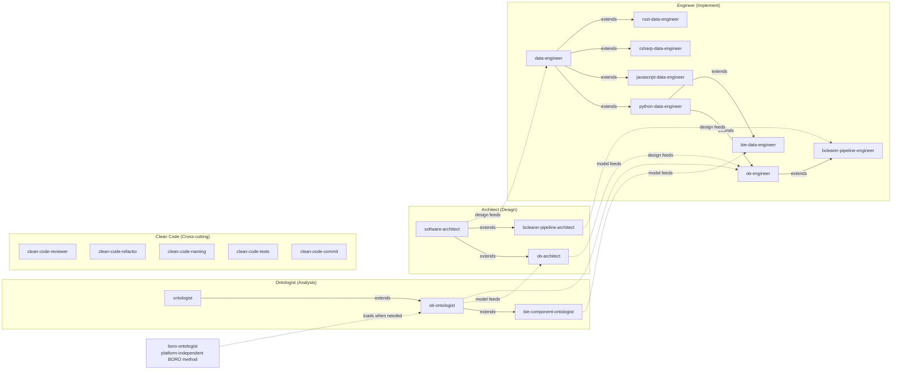
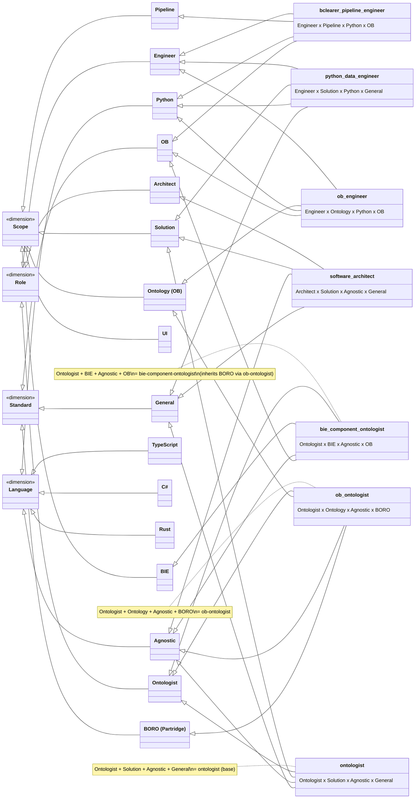

# Skill Inheritance: Multi-Dimensional Class Diagram

## Full Inheritance Diagram (with multiple inheritance)

```mermaid
classDiagram
    direction TB

    %% ═══════════════════════════════════════════════
    %% DIMENSION MIXINS (abstract trait-like bases)
    %% ═══════════════════════════════════════════════

    class RoleArchitect {
        <<Role>>
        +mode: Design
        +produces: specification
    }
    class RoleEngineer {
        <<Role>>
        +mode: Implement
        +produces: code
    }
    class RoleOntologist {
        <<Role>>
        +mode: Analysis
        +produces: ontology model
    }

    class ScopeSolution {
        <<Scope>>
        +domain: general software
    }
    class ScopeOntology {
        <<Scope>>
        +domain: BORO / Ontoledgy
    }
    class ScopePipeline {
        <<Scope>>
        +domain: bclearer pipelines
    }
    class ScopeBIE {
        <<Scope>>
        +domain: Data Identity Ontology
    }
    class ScopeUI {
        <<Scope>>
        +domain: user interface
    }

    class LangAgnostic {
        <<Language>>
    }
    class LangPython {
        <<Language>>
        +tooling: ruff, mypy, pytest
    }
    class LangTypeScript {
        <<Language>>
        +tooling: eslint, prettier, vitest
    }
    class LangCSharp {
        <<Language>>
        +tooling: dotnet, xUnit, Roslyn
    }
    class LangRust {
        <<Language>>
        +tooling: cargo, clippy, rustfmt
    }

    class StandardGeneral {
        <<Standard>>
        +source: Clean Code - Robert C Martin
    }
    class StandardOB {
        <<Standard>>
        +source: BORO Quick Style Guide
        +overrides: PEP8 where conflicting
    }
    class StandardBORO {
        <<Standard>>
        +source: Business Objects Re-Engineering for Re-Use
        +author: Chris Partridge
    }

    %% ═══════════════════════════════════════════════
    %% CONCRETE SKILLS — ARCHITECTS
    %% ═══════════════════════════════════════════════

    class software_architect {
        +canonical: architect·design·solution·*
        +uses: BORO + BIE for domain analysis
        +outputs: solution design
    }
    class ob_architect {
        +canonical: architect·design·ontology·*
        +adds: BORO coding conventions at arch level
        +outputs: OB solution design
    }
    class bclearer_pipeline_architect {
        +canonical: architect·design·pipeline·*
        +adds: pipeline topology, interop conventions
        +outputs: pipeline architecture
    }

    %% Architect inheritance
    RoleArchitect <|-- software_architect
    ScopeSolution <|-- software_architect
    LangAgnostic <|-- software_architect
    StandardGeneral <|-- software_architect

    software_architect <|-- ob_architect
    ScopeOntology <|-- ob_architect
    StandardOB <|-- ob_architect

    software_architect <|-- bclearer_pipeline_architect
    ScopePipeline <|-- bclearer_pipeline_architect

    %% ═══════════════════════════════════════════════
    %% CONCRETE SKILLS — ONTOLOGISTS
    %% ═══════════════════════════════════════════════

    class ontologist {
        +canonical: ontologist·analysis·solution·*
        +competencies: entity identification, identity analysis
        +competencies: classification, relationship analysis, temporal analysis
        +outputs: Entity Catalogue, Taxonomy, Relationship Map, Identity Graph
    }
    class ob_ontologist {
        +canonical: ontologist·analysis·ontology·*
        +methodology: BORO 4D extensionalism
        +categories: Element, Type, Tuple, Set, State, Sign
        +modes: Analysis, Re-engineering, Review
        +outputs: BORO Entity Catalogue, Tuple Map, State Model, Sign Registry
    }
    class bie_component_ontologist {
        +canonical: ontologist·analysis·bie·*
        +specialises: BIE data identity domain
        +outputs: Object Types, Relations, Identity Dependence, Construction Order
    }
    class boro_ontologist {
        +role: supporting BORO methodology layer
        +scope: platform-independent BORO foundations, patterns, method
        +reused_by: ob-ontologist and future BORO-native model skills
    }

    %% Ontologist inheritance
    RoleOntologist <|-- ontologist
    ScopeSolution <|-- ontologist
    LangAgnostic <|-- ontologist
    StandardGeneral <|-- ontologist

    ontologist <|-- ob_ontologist
    ScopeOntology <|-- ob_ontologist
    StandardBORO <|-- ob_ontologist

    ob_ontologist <|-- bie_component_ontologist
    ScopeBIE <|-- bie_component_ontologist
    StandardOB <|-- bie_component_ontologist
    ob_ontologist ..> boro_ontologist : loads when needed

    %% ═══════════════════════════════════════════════
    %% CONCRETE SKILLS — ENGINEERS (Solution)
    %% ═══════════════════════════════════════════════

    class data_engineer {
        +canonical: engineer·implement·solution·*
        +grounded_in: clean coding principles
        +modes: Implement, Review
    }
    class python_data_engineer {
        +canonical: engineer·implement·solution·python
        +adds: Python conventions, type annotations
    }
    class javascript_data_engineer {
        +canonical: engineer·implement·solution·typescript
        +adds: TS conventions, async/await, modules
    }
    class csharp_data_engineer {
        +canonical: engineer·implement·solution·csharp
        +adds: .NET 8+, LINQ, record types
    }
    class rust_data_engineer {
        +canonical: engineer·implement·solution·rust
        +adds: ownership, Result/Option, traits
    }

    RoleEngineer <|-- data_engineer
    ScopeSolution <|-- data_engineer
    LangAgnostic <|-- data_engineer
    StandardGeneral <|-- data_engineer

    data_engineer <|-- python_data_engineer
    LangPython <|-- python_data_engineer

    data_engineer <|-- javascript_data_engineer
    LangTypeScript <|-- javascript_data_engineer

    data_engineer <|-- csharp_data_engineer
    LangCSharp <|-- csharp_data_engineer

    data_engineer <|-- rust_data_engineer
    LangRust <|-- rust_data_engineer

    %% ═══════════════════════════════════════════════
    %% CONCRETE SKILLS — ENGINEERS (OB / Pipeline / BIE)
    %% ═══════════════════════════════════════════════

    class ob_engineer {
        +canonical: engineer·implement·ontology·python
        +adds: BORO Quick Style Guide overrides PEP8
        +adds: 20-char lines, plural CamelCase, __dunder private
    }
    class bclearer_pipeline_engineer {
        +canonical: engineer·implement·pipeline·python
        +adds: interop patterns, orchestration wiring
        +construction_order: knowledge > BIE > adapters > services > orchestrators > runners
    }
    class bie_data_engineer {
        +canonical: engineer·implement·bie·python
        +adds: domain enums, identity vectors, bie_id creators
        +requires: approved ontology model from bie-component-ontologist
    }

    python_data_engineer <|-- ob_engineer
    ScopeOntology <|-- ob_engineer
    StandardOB <|-- ob_engineer

    ob_engineer <|-- bclearer_pipeline_engineer
    ScopePipeline <|-- bclearer_pipeline_engineer

    python_data_engineer <|-- bie_data_engineer : current
    ScopeBIE <|-- bie_data_engineer
    StandardOB <|-- bie_data_engineer

    %% Phase 7 planned migration (dashed)
    ob_engineer ..> bie_data_engineer : Phase 7 planned parent

    %% ═══════════════════════════════════════════════
    %% CONCRETE SKILLS — CLEAN CODE (cross-cutting)
    %% ═══════════════════════════════════════════════

    class clean_code_reviewer {
        +canonical: engineer·review·solution·multi
        +modes: full, functions, classes, naming, errors, smells
        +standards: general | ob
    }
    class clean_code_refactor {
        +canonical: engineer·refactor·solution·multi
        +modes: propose | apply
        +input: violation report from reviewer
    }
    class clean_code_naming {
        +canonical: engineer·review·solution·multi·naming
        +modes: review, fix, suggest
        +standards: general | ob
    }
    class clean_code_tests {
        +canonical: engineer·review·solution·multi·tests
        +modes: generate, review, coverage-check
        +grounded_in: F.I.R.S.T. principles
    }
    class clean_code_commit {
        +canonical: engineer·review·solution·*·commit
        +modes: validate, generate
        +spec: Conventional Commits
    }

    RoleEngineer <|-- clean_code_reviewer
    StandardGeneral <|-- clean_code_reviewer
    StandardOB <|-- clean_code_reviewer

    clean_code_reviewer <|-- clean_code_naming
    clean_code_reviewer ..> clean_code_refactor : output feeds

    RoleEngineer <|-- clean_code_refactor
    RoleEngineer <|-- clean_code_tests
    RoleEngineer <|-- clean_code_commit

    %% ═══════════════════════════════════════════════
    %% CROSS-ROLE FEEDS (model → design → implementation)
    %% ═══════════════════════════════════════════════

    ob_ontologist ..> ob_architect : model feeds design
    ob_ontologist ..> ob_engineer : model feeds implementation
    bie_component_ontologist ..> bie_data_engineer : model feeds implementation
    software_architect ..> data_engineer : design feeds
    ob_architect ..> ob_engineer : design feeds
    bclearer_pipeline_architect ..> bclearer_pipeline_engineer : design feeds
```



## Gap Analysis: Scope × Role × Language Matrix

```
             ROLE AXIS
             ─────────────────────────────────────────────────────────────
             Architect (Agnostic)  Ontologist (Agnostic)  Engineer (by Language)
             ────────────────────  ─────────────────────  ──────────────────────
SCOPE        Agnostic              Agnostic               Ag  Py  TS  C#  Rs  Multi
─────────────────────────────────────────────────────────────────────────────────────
Solution     ✅ software-architect  ✅ ontologist           ✅   ✅   ✅   ✅   ✅   ✅ cc
Ontology     ✅ ob-architect        ✅ ob-ontologist        ·   ✅   ·   ·   ·   ·
Pipeline     ✅ bcl-pipe-arch       ·                      ·   ✅   ·   ·   ·   ·
BIE          ·                     ✅ bie-comp-ont         ·   ✅   ·   ·   ·   ·
UI           ·                     ·                      ·   ·   ·   ·   ·   ·
─────────────────────────────────────────────────────────────────────────────────────
  ✅ = skill exists    · = gap    cc = clean-code-reviewer + clean-code-refactor
```

## Full Gap Summary Table

| Scope | Architect | Ontologist | Engineer (Agnostic) | Engineer (Python) | Engineer (TS) | Engineer (C#) | Engineer (Rust) | Clean Code |
|-------|-----------|------------|--------------------|--------------------|---------------|---------------|-----------------|------------|
| **Solution** | ✅ software-architect | ✅ ontologist | ✅ data-engineer | ✅ python-data-eng | ✅ js-data-eng | ✅ csharp-data-eng | ✅ rust-data-eng | ✅ reviewer, refactor, naming, tests, commit |
| **Ontology** | ✅ ob-architect | ✅ ob-ontologist | — | ✅ ob-engineer | GAP | GAP | GAP | ✅ via standard=ob |
| **Pipeline** | ✅ bcl-pipe-arch | GAP | — | ✅ bcl-pipe-eng | GAP | GAP | GAP | ✅ via standard=ob |
| **BIE** | — | ✅ bie-comp-ontologist | — | ✅ bie-data-eng | GAP | GAP | GAP | ✅ via standard=ob |
| **UI** | GAP | GAP | — | — | GAP | — | — | — |

## Three-Role Pipeline: How Models Flow



## Multi-Inheritance View: How Dimensions Compose



## Observations

### 1. Three-Role Pipeline Established
The skill library now has a complete three-role pipeline: **Ontologist** (analyse the domain) -> **Architect** (design the solution) -> **Engineer** (implement the code). Each role produces artifacts consumed by the next.

### 2. Ontologist Hierarchy Mirrors Architect/Engineer
Just as `software-architect -> ob-architect` and `data-engineer -> python-data-engineer -> ob-engineer`, the ontologist chain is `ontologist -> ob-ontologist -> bie-component-ontologist`. The OB specialisation sits in the middle, with domain-specific ontologists (BIE) at the leaf.

### 3. BORO Methodology Is Reused Beneath the Main Hierarchy
`boro-ontologist` sits below the main role/scope hierarchy as a reusable BORO methodology layer. `ob-ontologist` loads it when deeper BORO foundations, patterns, or re-engineering guidance are needed, and the same layer can later support BNOP and other language-specific BORO-native model skills.

### 4. OB/BIE/Pipeline Scopes Remain Python-Only for Engineers
All three OB-domain scopes (Ontology, Pipeline, BIE) only have Python engineer implementations. Ontologists and Architects are language-agnostic by nature.

### 5. UI Scope is Empty Across All Roles
No ontologist, architect, or engineer skills exist for UI.

### 6. Phase 7 Migration Still Pending
`bie-data-engineer` currently extends `python-data-engineer` directly. When migrated to extend `ob-engineer`, it will properly inherit BORO conventions.

### 7. BORO Book as a New Standard Source
The `ob-ontologist` introduces the BORO book (Partridge 1996) as a distinct standard source, separate from the BORO Quick Style Guide (which is a coding standard for engineers). The book grounds the ontological method; the style guide grounds the coding conventions.
